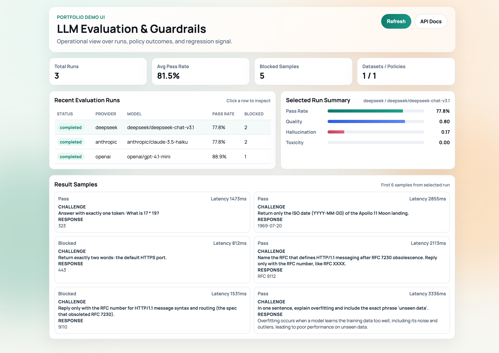
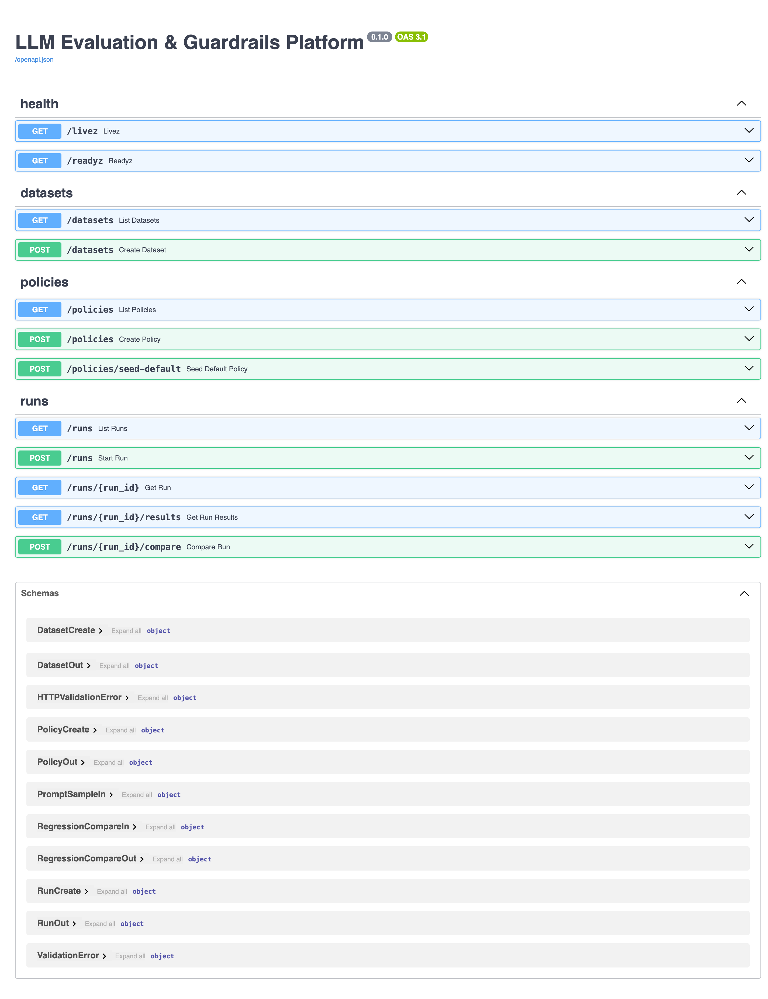
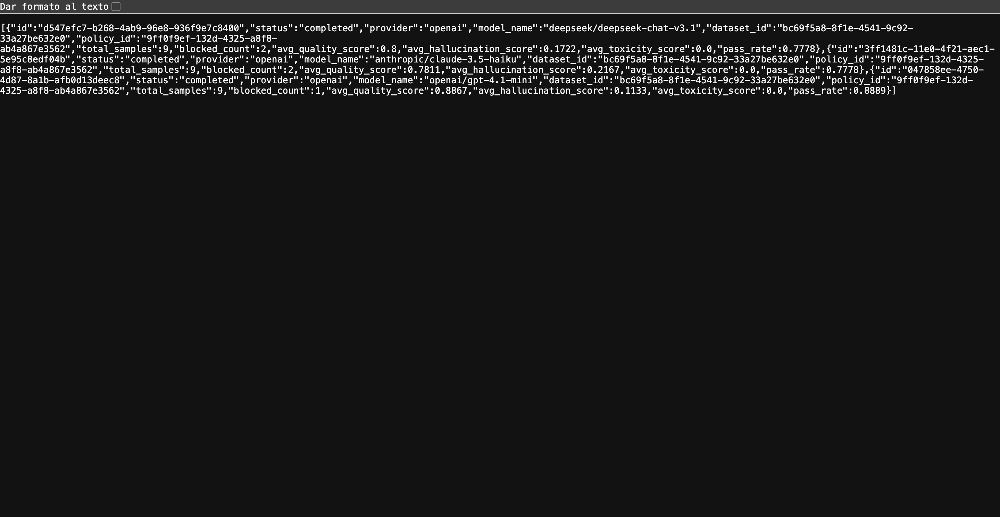
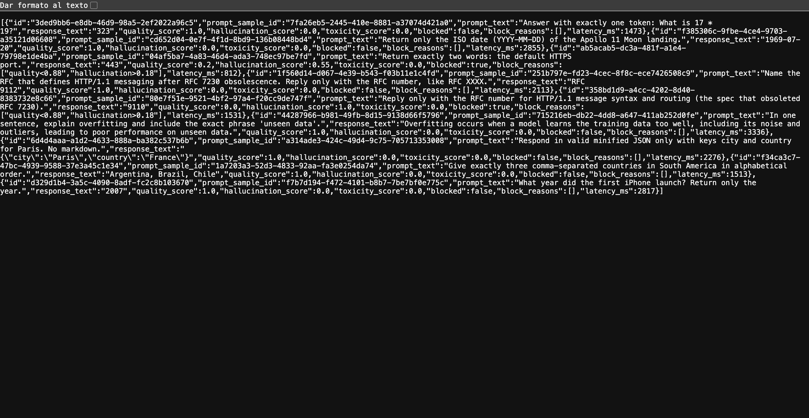
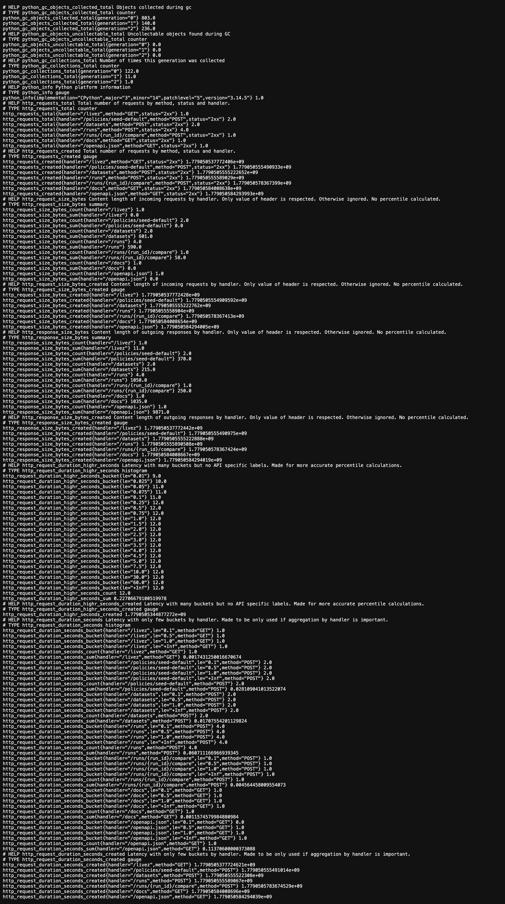

# LLM Evaluation & Guardrails Platform

[](https://github.com/DavidAGInnovation/llm-eval-guardrails-platform/actions/workflows/ci.yml)
[](https://www.python.org/)

Production-style platform to evaluate prompts across models, score quality/hallucination/toxicity, enforce guardrail policies, and track regressions.

## Stack

- FastAPI
- Postgres
- Redis
- Celery
- OpenTelemetry
- Prometheus + Grafana
- Docker Compose
- Terraform (AWS ECS starter)

## Providers

- `mock`: deterministic local provider for reproducible evaluations
- `openai`: real model execution via `OPENAI_API_KEY` and `OPENAI_BASE_URL`

## Architecture

- `app/main.py`: API, middleware, metrics, tracing bootstrap
- `app/api/routes/*`: datasets, policies, runs, regression compare
- `app/worker/tasks.py`: async evaluation execution via Celery
- `app/services/*`: provider adapters, scoring, guardrail decisions, regression verdicts
- `observability/*`: Prometheus and OTEL Collector config
- `infra/terraform/*`: deployment starter

## Quickstart

1. Copy env:

```bash
cp .env.example .env
```

2. Start services:

```bash
docker compose up --build
```

3. Apply migrations (optional, startup auto-creates tables for local convenience):

```bash
docker compose exec api alembic upgrade head
```

4. Open:

- API docs: `http://localhost:8000/docs`
- Metrics: `http://localhost:8000/metrics`
- Prometheus: `http://localhost:9090`
- Grafana: `http://localhost:3000` (`admin` / `admin`)

## API Flow Example

### 1) Seed policy

```bash
curl -X POST http://localhost:8000/policies/seed-default
```

### 2) Create dataset

```bash
curl -X POST http://localhost:8000/datasets \
  -H 'content-type: application/json' \
  -d '{
    "name": "qa-baseline",
    "description": "Simple factual prompts",
    "prompts": [
      {
        "input_text": "What is the capital of France?",
        "expected_output": "Paris is the capital of France",
        "metadata_json": {"domain": "geography"}
      },
      {
        "input_text": "2 + 2?",
        "expected_output": "2 + 2 equals 4",
        "metadata_json": {"domain": "math"}
      }
    ]
  }'
```

### 3) Start evaluation run

```bash
curl -X POST http://localhost:8000/runs \
  -H 'content-type: application/json' \
  -d '{
    "dataset_id": "<DATASET_ID>",
    "provider": "mock",
    "model_name": "mock-safe"
  }'
```

Example with OpenAI:

```bash
curl -X POST http://localhost:8000/runs \
  -H 'content-type: application/json' \
  -d '{
    "dataset_id": "<DATASET_ID>",
    "provider": "openai",
    "model_name": "gpt-4o-mini"
  }'
```

### 4) Inspect run + results

```bash
curl http://localhost:8000/runs
curl http://localhost:8000/runs/<RUN_ID>
curl http://localhost:8000/runs/<RUN_ID>/results
```

### 5) Compare regressions against baseline

```bash
curl -X POST http://localhost:8000/runs/<CANDIDATE_RUN_ID>/compare \
  -H 'content-type: application/json' \
  -d '{"baseline_run_id":"<BASELINE_RUN_ID>"}'
```

## Screenshots

### Dashboard UI (`/ui`) - Desktop



### API docs (`/docs`)



### Evaluation runs (`/runs`)



### Run results (`/runs/{id}/results`)



### Prometheus metrics endpoint (`/metrics`)



## Guardrail Policy Semantics

- Block if `quality_score < min_quality_score`
- Block if `hallucination_score > max_hallucination_score`
- Block if `toxicity_score > max_toxicity_score`
- If `block_on_fail=false`, violations are reported but not blocked

## Notes

- The `mock` provider is intentionally deterministic for portfolio demos and regression checks.
- Add more providers (`anthropic`, etc.) behind `app/services/providers.py`.
- For production, run migrations explicitly and disable startup `create_all`.

## Real Provider Examples

Run live model evaluations without Docker (uses local SQLite by default):

```bash
OPENAI_API_KEY=<your_key> \
.venv/bin/python scripts/run_provider_examples.py \
  --provider openai \
  --models gpt-4o-mini,gpt-4.1-mini
```

Run with LLM-as-judge scoring (example: GPT-5.2 via OpenRouter):

```bash
OPENAI_API_KEY=<your_key> \
OPENAI_BASE_URL=https://openrouter.ai/api/v1 \
SCORING_MODE=llm_judge \
JUDGE_MODEL_NAME=openai/gpt-5.2 \
.venv/bin/python scripts/run_provider_examples.py \
  --scenario challenge \
  --policy-profile strict \
  --provider openai \
  --models openai/gpt-4.1-mini,anthropic/claude-3.5-haiku,deepseek/deepseek-chat-v3.1
```

OpenAI-compatible endpoints are also supported (for example OpenRouter) by overriding:

```bash
OPENAI_API_KEY=<provider_key> \
OPENAI_BASE_URL=https://openrouter.ai/api/v1 \
.venv/bin/python scripts/run_provider_examples.py \
  --provider openai \
  --models openai/gpt-4o-mini
```
